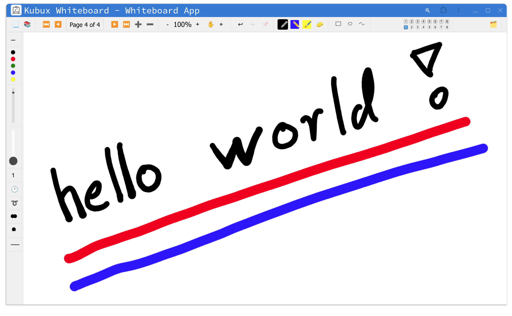

# Kubux Whiteboard Server

A real-time collaborative whiteboard application designed for mathematics education and collaboration. This project provides a WebSocket-based server and browser client that enables multiple users draw on a shared canvas in real-time. The idea is that you will run your own whiteboard server on your home lab.



## Features

- **Real-time collaboration** - Multiple users can simultaneously work on the same whiteboard
- **Multi-page support** - Create and navigate between multiple pages in a whiteboard
- **Spectator mode** - You can send invites that enable viewing (including navigation) but not editing
- **Rich drawing tools** - Pen, highlighter, and chalk tools with customizable properties
- **Shape tools** - Draw circles, rectangles, curves, and horizontal/vertical/diagonal lines
- **Advanced stroke controls** - Cap style (round/butt/square), join style (round/bevel/miter), and dash patterns (solid/dashed/dotted/longdash/dashdot)
- **Pressure sensitivity** - Adjustable sensitivity levels (0-9) for variable-width strokes
- **Path modes** - Open paths, closed paths, and filled shapes
- **Selection tools** - Rectangle, lasso, and stroke-based selection with cut/copy/paste
- **Layer system** - Organize content across 8 separate layers with visibility control
- **PDF export** - Export single pages or entire whiteboards as vector PDFs
- **Undo/redo** - Full history tracking with undo/redo capability
- **Board navigation** - Switch between multiple boards, copy shareable links, create new boards from within the app
- **Timer** - Times auto-undo.
- **Progressive Web App (PWA)** - Install as a standalone app on tablets and mobile devices
- **Offline service worker** - Offline support via service worker caching

## Installation

### Prerequisites

- Nix package manager (recommended) - Provides Node.js and all dependencies automatically
- Alternatively: Node.js (v14 or higher) and npm (v6 or higher)

### Setup

1. Clone the repository:
   ```bash
   git clone https://github.com/yourusername/kubux-whiteboard-server.git
   cd kubux-whiteboard-server
   ```

2. Create required directories:
   ```bash
   mkdir -p data conf logs
   ```

3. Set up authentication (for board creation):
   ```bash
   # Create a password hash using the provided utility
   ./passwd_hash your-secret-password
   
   # Copy the hash and create conf/passwd.json
   echo '["your-hash-here"]' > conf/passwd.json
   ```
   
   Example:
   ```bash
   ./passwd_hash mypassword123
   # Output: mypassword123  ->  a3f2b8c...salt...:d4e9f1a...hash...
   
   # Create conf/passwd.json with the hash
   echo '["a3f2b8c...salt...:d4e9f1a...hash..."]' > conf/passwd.json
   ```
   
   **Security Note:** The password hashing uses **scrypt**, a memory-hard key derivation function that is highly resistant to:
   - Rainbow table attacks (each password gets a unique random salt)
   - Brute-force attacks (computationally expensive to compute)
   - Hardware-accelerated attacks (memory-hard design)
   
   The hash format is `salt:hash` where both parts are hex-encoded.

4. Install dependencies (if using Nix):
   ```bash
   nix develop
   ```
   
   Or with npm directly:
   ```bash
   npm install
   ```

## Running the Server

The Kubux Whiteboard Server supports two modes of operation:

### Mode 1: Direct Mode (Local/Development)

This mode allows the server to listen on a specified port and serve the application directly without a reverse proxy. Perfect for local testing or ad-hoc usage.

```bash
KUBUX_WHITEBOARD_URL=http://localhost:8080 npm start
```

You can specify any port:
```bash
# Run on port 3000
KUBUX_WHITEBOARD_URL=http://localhost:3000 npm start
```

**Use case:** 
- Local testing and development
- If the specified port is exposed (not blocked by a firewall) and your computer is accessible from the ouside, you can use this mode to create an ad-hoc whiteboard sessions without a dedicated server


**Access:** Open your browser to the URL specified in `KUBUX_WHITEBOARD_URL` (e.g., http://localhost:8080)


### Mode 2: Docker with Reverse Proxy (Production)

For production deployments, the repository includes a Dockerfile and docker-compose.yml template for running with nginx-proxy and automatic SSL certificate management via Let's Encrypt.

#### Prerequisites
- Docker and Docker Compose installed
- A domain name pointing to your server
- nginx-proxy setup (included in docker-compose.yml)

#### Setup

1. **Integrate nginx-proxy and the whiteboard server into your docker-compose.yml**
   
   A minimal `docker-compose.yml` file (just the reverse proxy and the whiteboard server) is included in the distribution.  Replace the following placeholders:
   
   ```yaml
   # In the proxy service:
   - <your_nginx_dir>         # Directory for nginx-proxy data (e.g., /home/user/nginx-proxy)
   - <your_mail>              # Your email for Let's Encrypt notifications
   
   # In the whiteboard service:
   - <your_whiteboard_domain> # Your domain (e.g., whiteboard.example.com)
   - <app-dir>                # Directory containing your app data (e.g., /home/user/whiteboard-data)
   ```

2. **Create required directories on host**
   
   ```bash
   # Create nginx-proxy directories
   mkdir -p <your_nginx_dir>/{ssl,var/log/{nullmailer,unattended-upgrades,dockergen,dnsmasq,letsencrypt,nginx}}
   ```
   
3. **Start docker-compose**
   The docker-compose file does build the container for the whiteboard server directly from the Dockerfile. The provided Dockerfile employ the somewhat hacky trick of mounting the development directory directly into the container. If you have set up the data, logs, and conf directories and the password file for local testing, they can be directly reused for deployment.

4. **Support for PWA**
   Manually create the whiteboard referenced in manifest.json to support installation as a progressive web app. When the client points the browser to a shared URL, they should be offered the option to create a progressive web app. The advantage on a tablet is that the browser interface is removed in the web app which enlarges the available board space.
   

#### How it works

The Docker deployment uses a multi-container setup:

- **nginx-proxy container**: 
  - Handles SSL termination with Let's Encrypt
  - Routes traffic to the whiteboard container
  - Listens on ports 80 (HTTP) and 443 (HTTPS)

- **whiteboard container**:
  - Runs the Node.js whiteboard server
  - Exposes port 80 internally (no external port mapping)
  - Connects to proxy via Docker network
  - Environment variables:
    - `VIRTUAL_HOST`: Your domain name
    - `VIRTUAL_PORT`: 80 (tells nginx-proxy which internal port to use)
    - `LETSENCRYPT_HOST`: Domain for SSL certificate

**Traffic Flow:**
1. Client → HTTPS:443 (nginx-proxy)
2. nginx-proxy → HTTP:80 (whiteboard container)
3. Client connects via WSS (WebSocket Secure) through nginx-proxy

**Access:** https://your-whiteboard-domain/?credential=<your_password>

#### Managing the deployment

```bash
# View logs
docker-compose logs -f whiteboard

# Restart the whiteboard service
docker-compose restart whiteboard

# Stop all services
docker-compose down

# Rebuild after code changes
docker-compose up -d --build
```

## Usage

### Creating a New Whiteboard
    Point your browser at: "https://your-whiteboard-domain/?credential=<your_password>"
    
A new board will be created and the URL will change to point towards that board. The URL contains a password. Share the URL including the password with collaborators and leave out the password when sharing with spectators (the password is needed for editing not for viewing).
    

### Basic Controls

- **Drawing** - Select a drawing tool and draw directly on the canvas
- **Navigation** - Use the hand tool (✋) to pan around the canvas
- **Zooming** - Use the zoom controls or mouse wheel to zoom in/out
- **Undo/Redo** - Use the undo (↩) and redo (↪) buttons or keyboard shortcuts (Ctrl+Z, Ctrl+Y)
- **Page Management** - Add new pages, navigate between pages using the controls at the top
- **Board Navigation** - Click the folder icon (🗂️) to open the board navigation overlay, where you can copy board links, create new boards, or navigate to different boards by URL/UUID

### Tool Options

- **Color** - Select from predefined colors or open the color picker for custom colors
- **Width** - Adjust the stroke width using the slider (1-20)
- **Opacity** - Control transparency with the opacity slider
- **Shape Mode** - Toggle between freeform drawing and shape modes (curve, rectangle, circle, horizontal/vertical/diagonal lines)
- **Pressure Sensitivity** - Adjust sensitivity (0-9) for variable-width strokes based on input pressure

### Advanced Drawing Controls

The sidebar provides access to additional stroke properties:

- **Path Mode** - Choose between open paths (➰), closed paths (□), and filled shapes (■)
- **Cap Style** - Select round, butt, or square end caps for strokes
- **Join Style** - Select round, bevel, or miter corner joins
- **Dash Pattern** - Choose from solid, dashed, dotted, long dash, and dash-dot patterns

### Layers

- The whiteboard supports 8 separate drawing layers (numbered 1-8)
- Toggle layer visibility using the eye icons in the top toolbar
- Select active drawing layer using the number buttons below the visibility row
- Move selected elements between layers

### Selection and Clipboard

- Use the selection tools (rectangle, lasso, stroke) to select content
- Cut, copy, or move selected elements
- Move elements between layers
- Transform selections with scaling and rotation

### Timer

- Toggle the timer (🕐) in the sidebar to auto-undo drawing within a few seconds: think of temporarilry highlighting an element during a presentation).


## Technical Overview

### Architecture

The system uses a client-server architecture with WebSockets for real-time communication. The protocol is designed around an action-based model where each modification to the whiteboard is represented as an action that can be applied, undone, or redone.

Key components:
- **server.js** - WebSocket server handling client connections and message routing
- **shared.js** - Common code used by both client and server, including data structures, hashing, geometry, and PDF rendering
- **index.html** - Web client interface with integrated JavaScript

### Protocol

The communication protocol between clients and the server uses:
- WebSockets for real-time data exchange
- JSON message format with support for complex data types (Map, Set, BigInt)
- Hash-chain verification for ensuring state consistency
- Optimistic local updates for responsive UI
- Replay mechanism for resolving inconsistencies
- Sparse hash snapshots for efficient verification

For detailed protocol documentation, see [protocol.md](protocol.md).

### Rendering

The client uses an optimized two-canvas rendering approach:
- Static background canvas for committed content
- Foreground canvas for interactive elements (current stroke, selection, etc.)
- Incremental updates when possible for better performance

### Server Architecture

- **Dual-mode operation**: Direct mode (standalone) or proxy mode (behind nginx)
- **Page caching**: LRU cache (max 10 pages) with automatic eviction and persistence
- **Board caching**: LRU cache (max 10 boards) with automatic eviction and persistence
- **Periodic persistence**: State is saved to disk every 10 seconds
- **Ping mechanism**: Server pings connected clients every 5 seconds for state verification
- **Page deletion mapping**: When a page is deleted, a redirect chain maps the old UUID to its replacement
- **Graceful shutdown**: SIGTERM and SIGINT handlers persist state before exit

### Client Architecture

- **IndexedDB storage**: Pages are cached locally for persistence
- **Server hash validation**: Cached pages are validated against server hashes
- **Replay-based reconciliation**: When hash mismatches are detected, the client requests replay data from the server
- **Cache optimization**: Only re-render changed elements when possible

### Security

- **scrypt password hashing**: Memory-hard KDF resistant to brute force and rainbow table attacks
- **Password-protected editing**: Editing requires a board-specific password
- **Credential-based board creation**: Creation requires a server-level credential
- **No-auth viewing**: Viewing is possible without any authentication
- **Request validation**: Server validates all incoming requests for proper structure
- **Path traversal protection**: Hidden files and non-whitelisted paths are blocked
- **HSTS headers**: Added for HTTPS deployments behind reverse proxy

### File Serve Strategy

Only the root path (`/`) and a strict whitelist of PWA files are served:
- `/manifest.json`, `/sw.js`, `/icon-192.png`, `/icon-512.png`, `/apple-touch-icon.png`, `/favicon.ico`, `/robots.txt`
- The server embeds `shared.js` directly into `index.html` at request time to avoid serving raw JavaScript files

## Progressive Web App Support

The application includes full PWA support:
- **manifest.json**: Defines app name, icons, and display mode (standalone)
- **Service worker (sw.js)**: Caches application resources for offline use
- **Icons**: Multiple icon sizes (192x192, 512x512) and apple-touch-icon for iOS
- When installed on a tablet, the standalone mode removes browser UI, maximizing available canvas space

## Development

### Project Structure

```
kubux-whiteboard-server/
├── server.js           # Main WebSocket server
├── shared.js           # Shared code (data structures, hashing, PDF, geometry)
├── index.html          # Web client (HTML, CSS, and JavaScript)
├── protocol.md         # Protocol documentation
├── package.json        # Project configuration and dependencies
├── Dockerfile          # Docker image definition
├── docker-compose.yml  # Docker deployment template
├── flake.nix           # Nix flake for reproducible dev environment
├── passwd_hash         # Password hashing utility
├── data/               # Data storage directory
│   ├── *.board         # Board data files
│   ├── *.page          # Page data files
│   └── to_be_removed.json  # Deletion redirect mapping
├── conf/               # Configuration directory
│   └── passwd.json     # Password file
└── logs/               # Log files
    └── debug.log       # Server debug log
```


## License

[Apache License 2.0](LICENSE) - This project is licensed under the Apache License 2.0. See the LICENSE file for the full license text.


## Acknowledgements

- Many drawing features are inspired by [Xournal++](https://github.com/xournalpp/xournalpp), a comprehensive handwriting note-taking software
- AI models (Gemini and Claude) have assisted in generating large parts of the code. At some point, I even figured out how to prevent the AI from changing the protocol willy nilly.
